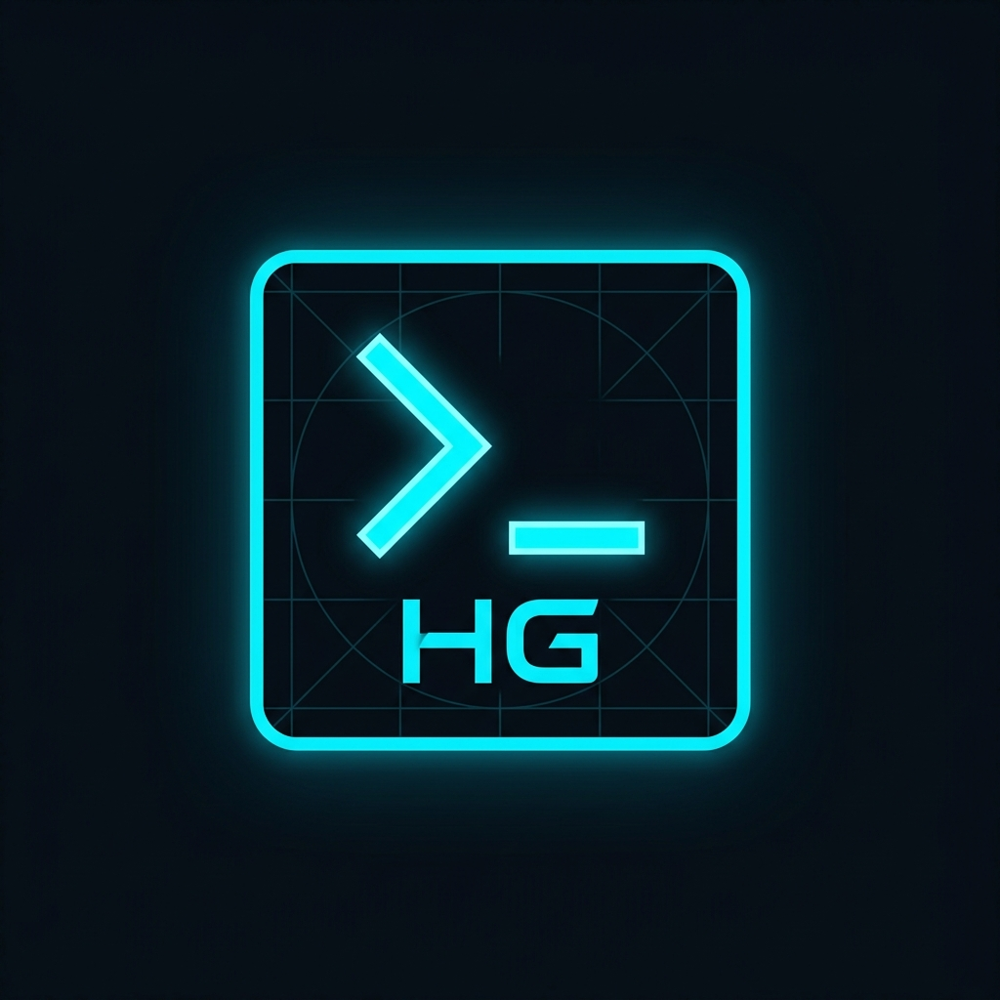

<div align="center">



# hussain.gandhi.biz

*Personal portfolio of Hussain Gandhi — DevOps Engineer specializing in Kubernetes, GitOps, and Observability.*

[](LICENSE)
[](https://hussain.gandhi.biz)
[](#technology-stack)

[Overview](#overview) • [Features](#features) • [Tech Stack](#technology-stack) • [Structure](#project-structure) • [Development](#local-development) • [Deployment](#deployment)

</div>

## Overview

A fast, accessible, single-page portfolio site built with plain HTML, CSS, and JavaScript. No frameworks, no build steps, no JavaScript runtime — just static files served from GitHub Pages.

The design leans into a **terminal-inspired OLED dark theme** with a typing-effect hero, scroll-driven reveal animations, and a simulated terminal window. Every section tells a piece of the story: who Hussain is, what he works on, and how to reach him.

## Features

- **Zero Build Step** — Raw HTML, Vanilla CSS (custom properties), and vanilla JS. No npm, no bundler, no overhead.
- **Terminal Aesthetic** — OLED black backgrounds, success-green accents, monospaced typography (`Space Grotesk` + `Archivo`), and an interactive terminal component in the about section.
- **Typing Effect** — Name animation in the hero with a blinking cursor. Instant-render fallback when `prefers-reduced-motion` is set.
- **Scroll Animations** — Elements fade in on scroll via `IntersectionObserver`. All animations respect the user's motion preferences.
- **Responsive** — Grid and Flexbox layouts that adapt from small phones to large desktops. Collapsible hamburger navigation on mobile.
- **Accessible** — Skip-to-content link, visible `:focus-visible` rings, keyboard-navigable menu, semantic HTML, and `aria-label` on icon-only controls.
- **SEO Ready** — Meta tags, `robots.txt`, and `sitemap.xml` included.

## Technology Stack

| Layer | Technology |
|-------|------------|
| Structure | HTML5 |
| Styling | Vanilla CSS (custom properties, CSS Grid, Flexbox) |
| Logic | Vanilla JavaScript |
| Icons | Font Awesome 7.0.1 |
| Fonts | Google Fonts — Archivo (body) & Space Grotesk (mono) |
| Hosting | GitHub Pages |
| Domain | `hussain.gandhi.biz` |

## Project Structure

```
.
├── docs/                  # Deployed static site (GitHub Pages source)
│   ├── index.html         # Single-page app — 6 sections
│   ├── style.css          # Design tokens, layout, components, animations
│   ├── script.js          # Typing effect, nav, scroll-to, observer logic
│   ├── profile.png        # Hero avatar
│   ├── favicon.png        # Browser favicon
│   ├── CNAME              # Custom domain record
│   ├── robots.txt         # Crawler directives
│   └── sitemap.xml        # Search engine sitemap
├── generate_sitemap.sh    # Utility to regenerate the sitemap
└── README.md
```

## Local Development

No toolchain required. Pick any method:

<details open>
<summary><b>Python HTTP server</b> (recommended)</summary>

```bash
git clone https://github.com/HussainTechSavvy/hussain.gandhi.biz.git
cd hussain.gandhi.biz
python3 -m http.server 8000 --directory docs/
```

Open `http://localhost:8000` in your browser.

</details>

<details>
<summary><b>VS Code Live Server</b></summary>

1. Install the [Live Server](https://marketplace.visualstudio.com/items?itemName=ritwickdey.LiveServer) extension.
2. Right-click `docs/index.html` → **Open with Live Server**.

</details>

<details>
<summary><b>Open directly</b></summary>

Just open `docs/index.html` in any browser. Some features (like the CNAME redirect) only work when served via HTTP, but the UI renders fine for quick previews.

</details>

## Deployment

The site is deployed to **GitHub Pages** from the `docs/` directory on the `main` branch.

> [!TIP]
> To deploy your own fork, go to **Settings** → **Pages**, set **Source** to `Deploy from a branch`, choose `main` and `/docs`.

```bash
git push origin main   # GitHub Pages picks up docs/ automatically
```

The custom domain is configured via the `docs/CNAME` file. GitHub Pages sends a deployment notification on every push to `main`.
